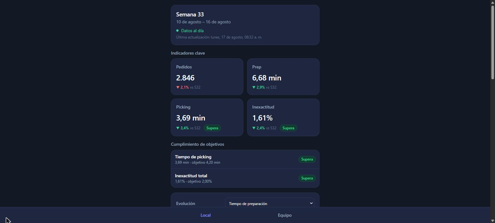
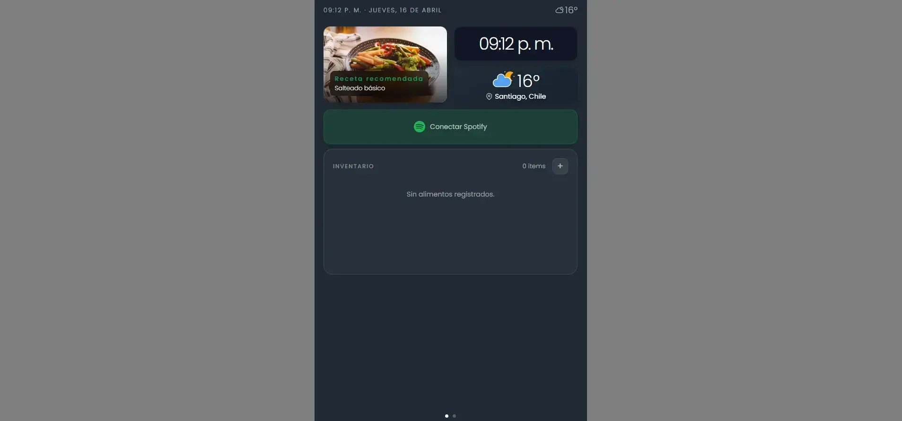
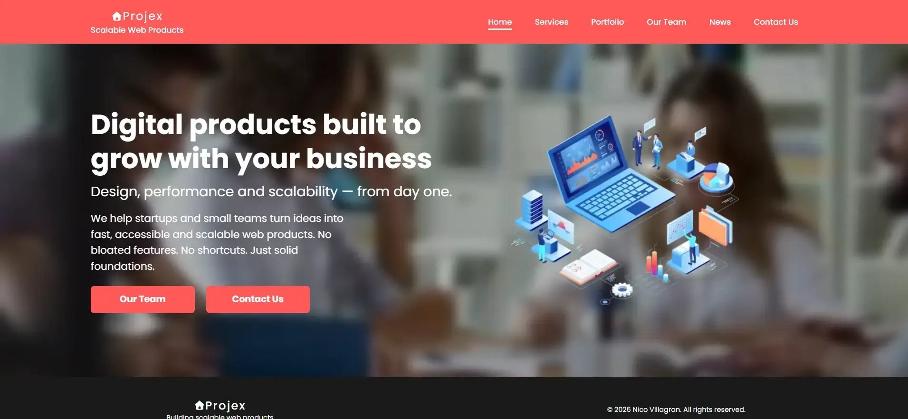

# Nicolás Villagrán — Frontend Developer

**Santiago, Chile** · React · TypeScript · Next.js · Abierto a oportunidades

**[nico-villagran.com](https://nico-villagran.com)** · [LinkedIn](https://www.linkedin.com/in/nico-villagran/) · [nicovillagranroses@gmail.com](mailto:nicovillagranroses@gmail.com) · [Mis APIs](https://github.com/nicovillagranr/APIs)

> Este repositorio es mi **diario de aprendizaje**: diez módulos, de HTML semántico a Docker,
> con la práctica y las decisiones técnicas documentadas por escrito.
> **Si vienes a evaluar mi trabajo, empieza por los proyectos de aquí abajo** — el resto del
> repositorio es el camino, no el destino.

---

## El portfolio

React 19 · Tailwind v4 · Vitest · **[Ver el sitio](https://nico-villagran.com)** · [Código](00-portfolio/00-hosting)

Una SPA que **consume mi propia API REST** ([`/projects`](https://00-portfolio-projects-api.vercel.app/projects) y [`/profile`](https://00-portfolio-projects-api.vercel.app/profile), desplegada en Vercel) y presenta el perfil y un catálogo filtrable, con un Hero interactivo en forma de editor de código.

La decisión técnica de la que estoy más contento: los datos se piden a la API en runtime, pero en *build time* se genera un **snapshot de respaldo**, así que si la API no responde el sitio se pinta igualmente con el último estado conocido en lugar de quedarse en blanco. Con tests de la capa de datos y de la tarjeta de proyecto (Vitest + Testing Library).

## Proyectos destacados

| | Proyecto | Qué demuestra | Stack | |
|---|---|---|---|---|
|  | **Store Pulse** | PWA instalable con las métricas de un local en tres niveles: local, equipo y persona. Cada métrica se declara una vez en un registro que dice hacia qué lado mejora, así que la flecha y el color de cada variación salen del dato en vez de repetirse a mano. **TypeScript estricto, Zod en la frontera y 82 tests en verde.** | React 19 · TypeScript · Tailwind v4 · Recharts · Zod | **[Demo](https://nico-villagran.com/store-pulse/)** · [Código](00-portfolio/01-react/portfolio/01-store-pulse) |
|  | **Smart Cooler UI** | Dashboard de producto con datos meteorológicos **en tiempo real** (Open-Meteo), inventario persistido en localStorage y recetas sugeridas según lo guardado. **40 tests en verde** (Vitest). | React 19 · Tailwind v4 · Vitest | [Código](00-portfolio/01-react/portfolio/02-smart-cooler-ui) |
|  | **Projex** | Landing por secciones con animaciones de entrada y **formulario de contacto con validación accesible**: los errores se anuncian con `role="alert"` y el foco queda atrapado en el menú y el modal. El envío es una demo, sin backend. | React 19 · Tailwind v4 · Framer Motion · React Router | **[Demo](https://nico-villagran.com/projex/)** · [Código](00-portfolio/01-react/portfolio/03-projex) |

Van **ordenados por dificultad técnica**, igual que las carpetas del repo, y son **los que están publicados**: es el mismo criterio que decide qué vive en [`00-portfolio/01-react/portfolio/`](00-portfolio/01-react/portfolio) — estar en la API y responder en el dominio. En [`00-portfolio/`](00-portfolio) hay más: un clon de Falabella con App Router desplegado en Vercel, landings, práctica de layout y versiones iterativas.

## APIs propias

Las construí para no depender de datos de terceros en mis propios proyectos. Node.js + json-server, desplegadas en Vercel con CORS abierto.

| API | Qué sirve | |
|---|---|---|
| **Portfolio Projects API** | Los proyectos y el perfil que consume el portfolio. | [Ver JSON](https://00-portfolio-projects-api.vercel.app/) · [Código](https://github.com/nicovillagranr/APIs/tree/main/00-portfolio-projects) |
| **Products API** | 50 productos de moda con categoría, tipo, imagen y precio. | [Ver JSON](https://01-products-api.vercel.app/) · [Código](https://github.com/nicovillagranr/APIs/tree/main/01-products-api) |

---

## Sobre este repositorio / About this repository

This repository tracks my frontend learning path with a practical and progressive structure.
The goal is to build strong fundamentals, document technical decisions, and evolve projects
into portfolio-ready work for a first frontend developer role.

Este repositorio documenta mi camino de aprendizaje en frontend con una estructura práctica y progresiva.
El objetivo es construir fundamentos sólidos, documentar decisiones técnicas y convertir proyectos
en piezas listas para un portfolio profesional.

Dos ejemplos de lo que hay dentro, por si el recorrido dice más que el resultado:

- [`01-learning/05-typescript/`](01-learning/05-typescript) — entrenamiento propio de TypeScript: **90 ejercicios con sus tests** (Vitest), con `strict`, `noUncheckedIndexedAccess` y `exactOptionalPropertyTypes` activados. Si al correr la suite ves algún test en rojo, es el ejercicio en curso: los *starters* se dejan fallando a propósito.
- [`01-learning/00-docs/`](01-learning/00-docs) — convenciones de nombres, política de ubicación de proyectos y decisiones técnicas escritas antes de aplicarlas.

## Quick Navigation / Navegación rápida

- Main documentation index / Índice principal de documentación: `01-learning/00-docs/README.md`
- Repository overview / Vista general del repo: `01-learning/00-docs/00-overview/readme.md`
- Quick return guide / Guía de retoma rápida: `01-learning/00-docs/00-overview/retoma-rapida.md`
- Naming rules / Convenciones de nombres: `01-learning/00-docs/00-overview/naming-conventions.md`
- Projects location policy / Política de ubicación de proyectos: `01-learning/00-docs/00-overview/projects-location-policy.md`
- Session memory log / Registro de sesiones: `01-learning/00-docs/00-overview/session-log.md`

## Repository Structure / Estructura del repositorio

Dos puertas: lo terminado y el camino que llevó hasta ahí.
Two doors: the finished work, and the path that led to it.

```
00-portfolio/     Proyectos aplicados — lo que enseño / Applied projects
   00-hosting/       el sitio del portfolio / the portfolio site
   01-react/         proyectos React + Vite
      portfolio/     el escaparate: lo publicado / the showcase: what is live
         01-store-pulse/  02-smart-cooler-ui/  03-projex/
      privados/      en curso, practica y archivo / WIP, practice and archive
         01-sport-mindset/ ... 07-smart-cooler-ui-versions/
   02-next/          proyectos Next.js
      privados/      ninguno publicado todavia / none published yet

   El NN de cada proyecto ordena por dificultad tecnica, de mas a menos.
   El slug es lo que identifica: 03-projex se publica en /projex/.
   NN orders by technical difficulty; the slug is the identity.

01-learning/      La ruta de aprendizaje / The learning path
   00-docs/          documentación, estándares y decisiones
   01-git/           Git y GitHub
   02-html/          HTML semántico y accesibilidad
   03-css/           arquitectura, layouts y frameworks
   04-javascript/    fundamentos, DOM, POO, async y librerías
   05-typescript/    entrenamiento de TypeScript
   06-react/         ruta de React
   07-nextjs/        ruta de Next.js
   09-docker/        guías y material de Docker
   10-claudeCode/    notas y experimentos con Claude Code

scripts/          Utilidades de mantenimiento del repo / Repo maintenance
```

La numeración de cada módulo se conserva: es el orden en que los recorrí.
Module numbering is preserved: it is the order in which I went through them.

## Working Rules / Reglas de trabajo

- Semantic HTML and accessibility first / HTML semántico y accesibilidad primero.
- Progressive complexity over one-shot complexity / Complejidad progresiva en vez de complejidad de golpe.
- Keep decisions documented / Mantener las decisiones documentadas.
- Prioritize readability and maintainability / Priorizar legibilidad y mantenibilidad.

## Local Run / Ejecución local

This repo contains multiple independent projects.
Each one has its own `package.json` and declares `"packageManager": "pnpm@10.18.1"`.
**All projects use pnpm**, not npm.

Este repositorio contiene múltiples proyectos independientes.
Cada uno tiene su propio `package.json` y declara `"packageManager": "pnpm@10.18.1"`.
**Todos los proyectos usan pnpm**, no npm.

1. Open a project folder / Abrí la carpeta de un proyecto.
2. Install dependencies / Instalá dependencias: `pnpm install`
3. Run scripts / Ejecutá scripts: `pnpm dev`, `pnpm lint`, `pnpm build`

## Repo Health Check / Chequeo de salud del repo

```powershell
powershell -ExecutionPolicy Bypass -File scripts/repo-health.ps1
```
